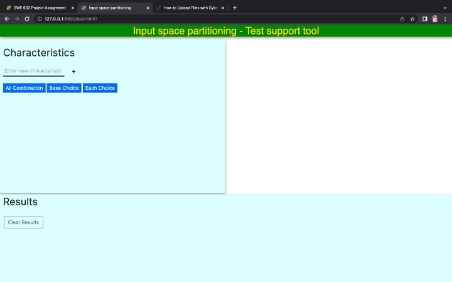
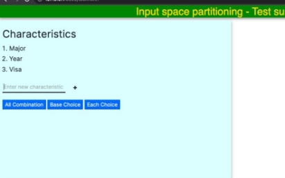
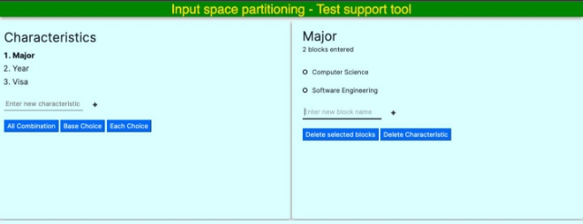

**Milestone - 6** 

Sai Rohith Pasham Srikanth Dubba 

**Project - Input space partitioning** 

We have designed and developed a webpage for input space partitioning. The user will be able to enter characteristics and blocks for each characteristic. The tool computes and returns combinations based on several test criteria - all combinations, base choice, each choice combinations. 

We have developed our webpage using html, css, javascript and jquery. Our webpage is hosted on the mason’s server. 

How to Run and use the webpage:  

1. Enter the following URL to open the webpage 

`       `<https://mason.gmu.edu/~spasham/swe/tool.html> 

2. Enter the characteristics in the textbox under the Characteristics heading.  

3. Click on the entered characteristic and now enter the blocks on the right hand menu which pops up as soon as a characteristic is selected. 

   

4. Enter all the data and select the desired test criterion to view the results.  

Software Design: 

Our goal was to make the data entry as convenient to the user as possible. We have divided the page into 3 sections, the first pane allows the user to enter, view, and select characteristics. The second pane opens when a characteristic is selected by the user and it allows the user to enter blocks for that selected characteristic. We have added checkboxes to select multiple blocks and added the option to delete them. Also, the base blocks can be selected by the checkboxes for the base choice criteria. The inputs are stored in the browser, so any accidental refresh or closing of the tab will not make the inputs to disappear. 

Things that were planned but not implemented: 

1\. Edit button to edit the blocks or characteristics. We found some bugs in the code and couldn’t resolve them. So, we decided not to add it.  

Notes: 

1. The base choice criterion gives incorrect output for some particular instances but always gives the correct output if the 1st block in every characteristic is selected. 
1. The block counter has a bug while selecting the blocks for the base choice. 
